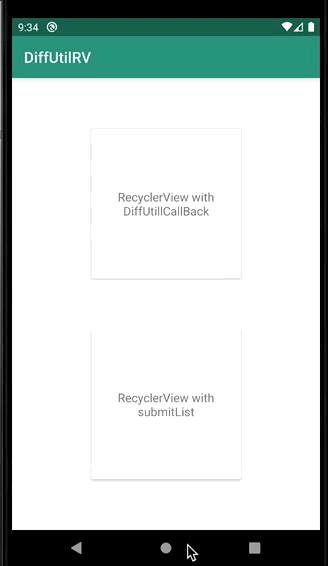

# DiffUtilRecyclerView

Here in this repository I use two lists of coin and update my list with these two.

for updating first I use a ListAdapter which can compute diffs using DiffUtil on a background thread. and is good for short lists.

and then I use DiffUtil.DiffResult which is better to be used when you have a long list.
